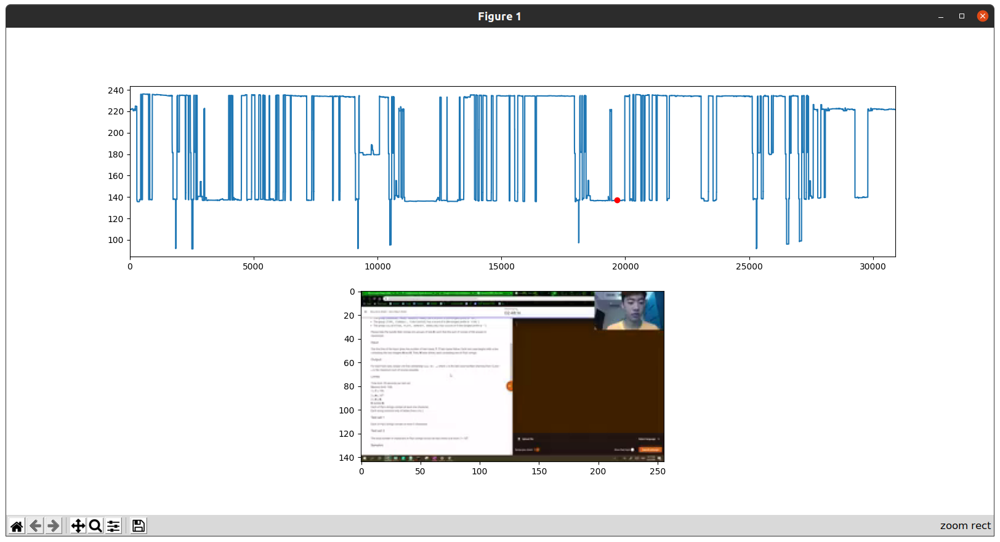

# uGrBHohIgQY-analysis

Analyses the time spent on different activies in the video *[Winning Google Kickstart Round A 2020 + Facecam](https://www.youtube.com/watch?v=uGrBHohIgQY)*



NB: video copyright William Lin

## Setup

Install [ffmpeg](https://ffmpeg.org/download.html), [youtube-dl](https://ytdl-org.github.io/youtube-dl/download.html), [python3](https://www.python.org/downloads/), [pip3](https://pip.pypa.io/en/stable/reference/pip_install/), [virtualenv](https://pypi.org/project/virtualenv/)

```
./download.sh
python3 -m venv env
pip3 install -r requirements.txt
```

## Running

```
python script.py
```